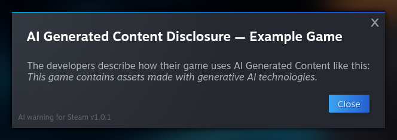

# AI warning for Steam

Shows the _AI Generated Content Disclosure_ on Steam store pages as a modal popup.

If a Steam store page contains an _AI Generated Content Disclosure_, this extension will display it as a modal popup, instead of just at the end of the page. Additionally, it will blur out the rest of the page until the popup is dismissed.

## Installation

**AI warning for Steam** can be installed as a native browser extension for Firefox or Chrome, or as a userscript for any supported browser. All variants run the exact same code, so installation and updates are the only differences.

### Option 1: Install as a browser extension for Firefox or Chrome

This is the easier option, but updates can sometimes be delayed, because Mozilla and Google need to approve them first. (Usually this shouldn't take more than a day.) Just follow the appropriate link for your browser and click the install button.
- [Firefox Add-ons](https://addons.mozilla.org/firefox/addon/ai-warning-for-steam/)
- [Chrome Web Store](https://chromewebstore.google.com/detail/ai-warning-for-steam/clegcobheppnnigaaeelfkeomjcngmnh)

### Option 2: Install as a userscript

This option is slightly less straight-forward, if you've never used a userscript, but you get updates as soon as they're available.
1. If necessary, install a userscript manager for your browser, for example by following the instructions at [Greasy Fork](https://greasyfork.org/#home-step-1).
2. [Click here to install the userscript](https://github.com/seeeeew/aiwarningforsteam/raw/refs/heads/main/aiwarningforsteam.user.js) _or_ download [`aiwarningforsteam.user.js`](https://github.com/seeeeew/aiwarningforsteam/blob/main/aiwarningforsteam.user.js) to install it manually.

## Platform and Language Support

The native browser extension should work in any up-to-date version of Firefox, Chrome, or any related browsers that can install extensions from the same sources, on any desktop OS. The Firefox version also works on mobile systems.

The userscript should work in any up-to-date browser with userscript support on any desktop or mobile OS.

The extension supports all languages officially supported by the Steam store, but the download/installation pages as well as metadata like the extension description are only available in English.

## Project Scope

This extension's sole purpose is making the _AI Generated Content Disclosure_ impossible to miss on Steam store pages where it exists. Future updates might improve this functionality, but will not add unrelated features.
