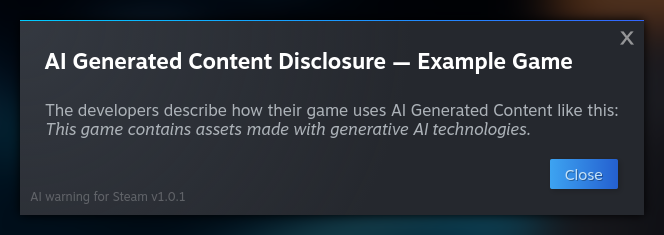
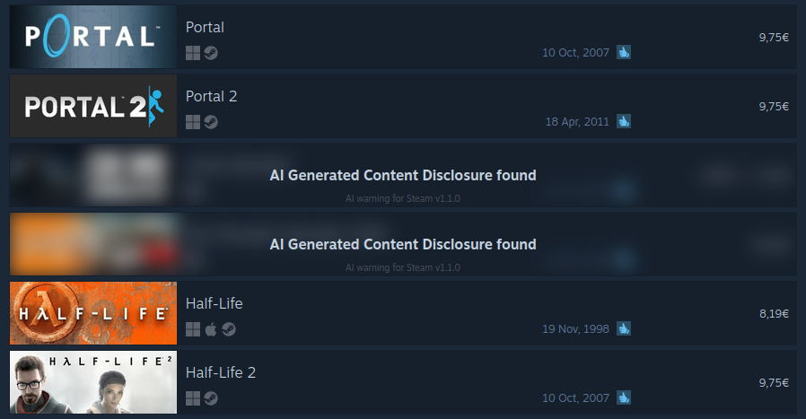

# AI warning for Steam

**AI warning for Steam** is a browser extension and userscript that adds features to increase the visibility of AI Generated Content Disclosures in the Steam store.

## Features

- Display the AI Generated Content Disclosure on Steam store pages as a model popup on page load, if present.
- Blur or hide games with an AI Generated Content Disclosure on search pages in the Steam store.

## Installation

**AI warning for Steam** can be installed as a native browser extension for Firefox or Chrome, or as a userscript for any supported browser. All variants run the exact same code, so installation and updates are the only differences.

### Option 1: Install as a browser extension for Firefox or Chrome

This is the easier option, but updates can sometimes be delayed, because Mozilla and Google need to approve them first. (Usually this shouldn't take more than a day.) Just follow the appropriate link for your browser and click the install button.
- [Firefox Add-ons](https://addons.mozilla.org/firefox/addon/ai-warning-for-steam/)
- [Chrome Web Store](https://chromewebstore.google.com/detail/ai-warning-for-steam/clegcobheppnnigaaeelfkeomjcngmnh)

### Option 2: Install as a userscript

This option is slightly less straight-forward, if you've never used a userscript, but you get updates as soon as they're available.
1. If necessary, install a userscript manager for your browser. ([Greasy Fork](https://greasyfork.org/#home-step-1) has instructions.)
2. [Click here to install the userscript](https://github.com/seeeeew/aiwarningforsteam/raw/refs/heads/main/aiwarningforsteam.user.js) _or_ download [`aiwarningforsteam.user.js`](https://github.com/seeeeew/aiwarningforsteam/blob/main/aiwarningforsteam.user.js) to install it manually.

## Platform and language support

The native browser extension should work in any up-to-date version of Firefox, Chrome, or any related browsers that can install extensions from the same sources, on any desktop OS. The Firefox version also works on mobile systems.

The userscript should work in any up-to-date browser with userscript support on any desktop or mobile OS.

The extension should work in all languages officially supported by the Steam store, but not all features are translated into languages other than English.

## Project goal

The purpose of this extension is to give users better visibility of information about whether generative AI was used in the creation of games they're browsing on Steam. Future updates might improve this functionality, but will not add unrelated features.
